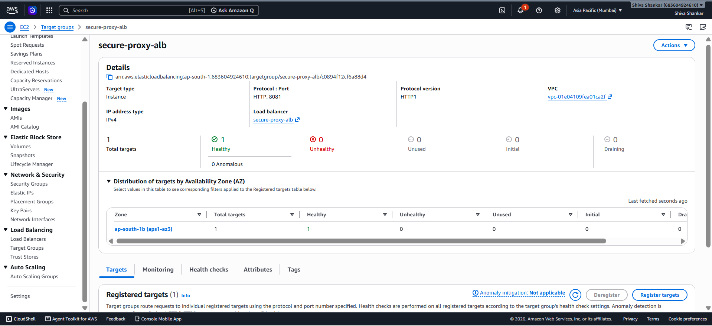
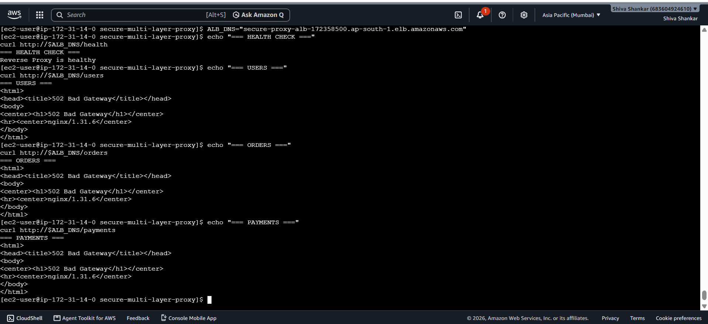
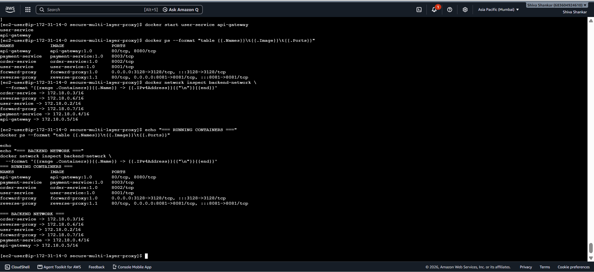
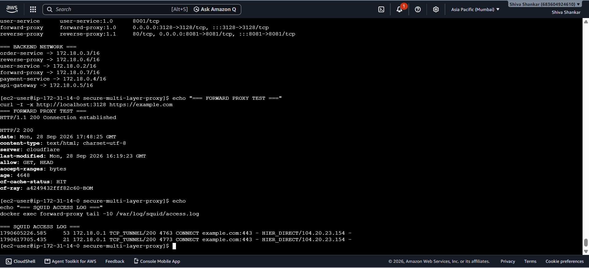
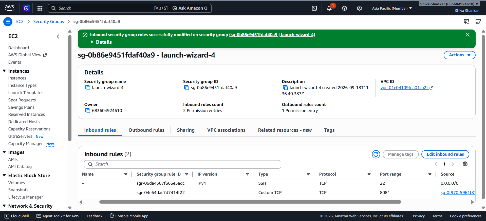
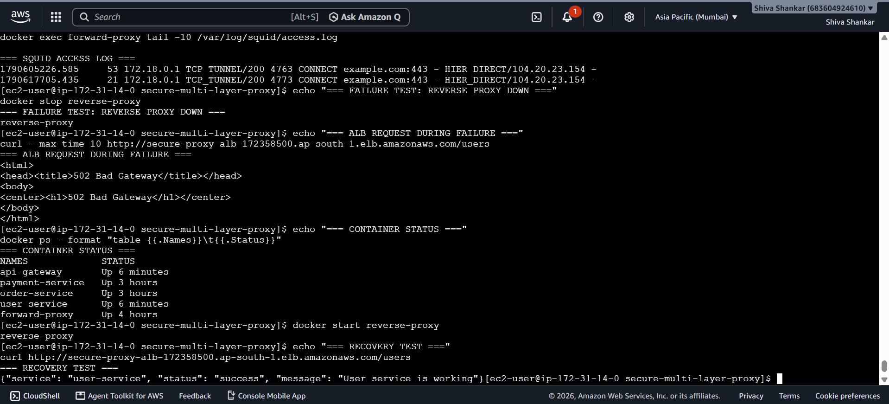

# Secure Multi-Layer Proxy Architecture

A production-style multi-layer proxy architecture built using **AWS, Docker, Nginx, Squid and FastAPI**.

The project demonstrates secure traffic flow from external users through an AWS Application Load Balancer, Nginx Reverse Proxy and API Gateway to isolated containerized microservices.

It also implements a Squid Forward Proxy for controlled outbound Internet access.

---

## 1. Project Objective

The objective of this project is to build a secure, layered application architecture where each component has a clearly defined responsibility.

The architecture demonstrates:

- AWS Application Load Balancer
- Nginx Reverse Proxy
- Nginx API Gateway
- Dockerized microservices
- Docker private networking
- Squid Forward Proxy
- AWS Security Groups
- Health checks
- Application logging
- Failure testing
- Troubleshooting and recovery

---

## 2. Architecture

```text
                         INTERNET
                            |
                            |
                    External Users
                            |
                            v
                +----------------------+
                |   AWS Application    |
                |    Load Balancer     |
                |        :80           |
                +----------+-----------+
                           |
                           | TCP 8081
                           v
                +----------------------+
                |   Nginx Reverse      |
                |       Proxy          |
                |       :8081          |
                +----------+-----------+
                           |
                           | HTTP :8080
                           v
                +----------------------+
                |   Nginx API Gateway  |
                |       :8080          |
                +----------+-----------+
                           |
              +------------+-------------+
              |            |             |
              v            v             v
           /users       /orders       /payments
              |            |             |
              v            v             v
       +----------+  +----------+  +----------+
       |  User    |  |  Order   |  | Payment  |
       | Service  |  | Service  |  | Service  |
       |  :8001   |  |  :8002   |  |  :8003   |
       +----------+  +----------+  +----------+
              \            |             /
               \           |            /
                +-----------------------+
                | Docker backend-network|
                +-----------------------+


                    INTERNAL USERS
                          |
                          v
                +----------------+
                | Squid Forward  |
                | Proxy :3128    |
                +-------+--------+
                        |
                        v
                     INTERNET
3. Request Flow
External User Request

External users access the application through the AWS Application Load Balancer.

Example:

GET /users

Traffic flows through:

Client
  |
  v
AWS Application Load Balancer
  |
  v
Nginx Reverse Proxy
  |
  v
Nginx API Gateway
  |
  v
User Service
Order Request
GET /orders

Traffic flows:

Client
  |
  v
ALB
  |
  vwq


Reverse Proxy
  |
  v
API Gateway
  |
  v
Order Service
Payment Request
GET /payments

Traffic flows:

Client
  |
  v
ALB
  |
  v
Reverse Proxy
  |
  v
API Gateway
  |
  v
Payment Service
4. Forward Proxy Flow

The Squid Forward Proxy handles outbound Internet access.

Internal User
      |
      v
Squid Forward Proxy
      |
      v
Internet

Example:

curl -I -x http://localhost:3128 https://example.com

Squid records the request in its access logs.

5. Components
Component	Technology	Purpose
Load Balancer	AWS Application Load Balancer	Public application entry point
Reverse Proxy	Nginx	Receives traffic from ALB
API Gateway	Nginx	Routes API requests
User Service	FastAPI + Docker	User API
Order Service	FastAPI + Docker	Order API
Payment Service	FastAPI + Docker	Payment API
Forward Proxy	Squid	Outbound Internet access
Container Network	Docker	Private service communication
Security	AWS Security Groups	Network access control
Version Control	Git/GitHub	Source code management
6. API Routes
Endpoint	Destination
/users	User Service
/orders	Order Service
/payments	Payment Service
/health	Reverse Proxy Health Endpoint
7. Security Design

The backend services are not directly exposed to the Internet.

The application uses multiple security layers:

Internet
   |
   v
AWS ALB
   |
   v
Reverse Proxy
   |
   v
API Gateway
   |
   v
Private Docker Network
   |
   +---- User Service
   +---- Order Service
   +---- Payment Service

The backend services run without Docker host-port mappings.

Example:

docker run -d \
  --name user-service \
  --network backend-network \
  user-service:1.0

The services therefore communicate through Docker networking instead of being directly exposed through the EC2 host.

8. Security Group Design

The ALB acts as the public entry point.

The EC2 instance accepts reverse-proxy traffic only from the ALB Security Group.

Internet
    |
    | TCP 80
    v
ALB Security Group
    |
    | TCP 8081
    v
EC2 Security Group
    |
    v
Reverse Proxy

Backend application ports are not publicly exposed.

SSH access should be restricted to trusted administrator IP addresses in a production environment.

9. Docker Network

The backend services communicate through:

backend-network

Docker DNS provides service discovery.

Example:

docker exec api-gateway getent hosts user-service
docker exec api-gateway getent hosts order-service
docker exec api-gateway getent hosts payment-service

The API Gateway can then communicate using:

user-service:8001
order-service:8002
payment-service:8003
10. Health Check

The AWS ALB uses:

/health

as the health-check endpoint.

The Reverse Proxy returns:

HTTP 200
Reverse Proxy is healthy

The dedicated health endpoint was introduced because the initial ALB health check against / returned HTTP 404.

11. Logging

Logs are available at each layer.

API Gateway
docker logs api-gateway
Reverse Proxy
docker logs reverse-proxy
User Service
docker logs user-service
Order Service
docker logs order-service
Payment Service
docker logs payment-service
Forward Proxy
docker exec forward-proxy \
  tail -20 /var/log/squid/access.log
12. Testing

The complete application flow was tested through the ALB.

curl http://<ALB-DNS>/health

curl http://<ALB-DNS>/users

curl http://<ALB-DNS>/orders

curl http://<ALB-DNS>/payments

Expected behavior:

/health
    |
    +---- Reverse Proxy health response

/users
    |
    +---- User Service

/orders
    |
    +---- Order Service

/payments
    |
    +---- Payment Service

The Forward Proxy was tested using:

curl -I -x http://localhost:3128 https://example.com
13. Failure Scenarios

The following failure scenarios were tested:

ALB health-check failure
Reverse Proxy failure
API Gateway failure
User Service failure
Security Group connectivity failure

Detailed troubleshooting procedures are documented in:

testing/failure-scenarios.md
14. Troubleshooting Methodology

When an application request fails, troubleshooting follows the request path.

Client
  |
  v
ALB
  |
  v
Reverse Proxy
  |
  v
API Gateway
  |
  v
Microservice

At each layer:

Check component status
Check listening ports
Check logs
Check network connectivity
Check Security Groups
Check health status
Test the component independently
Perform end-to-end testing
15. Project Structure
secure-multi-layer-proxy/
│
├── README.md
├── findings.md
│
├── architecture/
│   └── architecture.md
│
├── testing/
│   └── failure-scenarios.md
│
├── api-gateway/
│   ├── Dockerfile
│   └── nginx.conf
│
├── reverse-proxy/
│   ├── Dockerfile
│   └── nginx.conf
│
├── forward-proxy/
│   ├── Dockerfile
│   └── squid.conf
│
└── services/
    ├── user-service/
    ├── order-service/
    └── payment-service/
16. Key Learnings

This project provided hands-on experience with:

AWS Application Load Balancer
AWS Security Groups
Docker containers
Docker bridge networking
Docker DNS
Nginx Reverse Proxy
Nginx API Gateway
Squid Forward Proxy
FastAPI microservices
Health checks
Logging
Network isolation
Failure injection
Troubleshooting
Git
GitHub
SSH-based Git authentication
17. Production Improvements

For a production deployment, the following improvements could be implemented:

Networking
Private subnets
NAT Gateway
Multi-AZ architecture
Route 53
VPC endpoints where appropriate
Security
HTTPS/TLS
AWS WAF
AWS Secrets Manager
Least-privilege IAM
Restricted SSH access
Container image scanning
Compute
ECS/Fargate or EKS
Auto Scaling
Multi-AZ deployment
Rolling or blue/green deployments
Monitoring
CloudWatch Logs
CloudWatch Metrics
CloudWatch Alarms
Centralized logging
Distributed tracing
Infrastructure
Terraform
CI/CD pipeline
Automated security scanning
18. Interview Explanation

I implemented a secure multi-layer proxy architecture on AWS. External traffic enters through an Application Load Balancer and is forwarded to an Nginx reverse proxy. The reverse proxy communicates with an internal Nginx API Gateway, which routes requests to containerized User, Order and Payment microservices through a private Docker network. The backend services are not directly exposed through host ports. I also implemented a Squid forward proxy for outbound Internet access, configured Security Groups to restrict traffic between layers, implemented health checks and logging, and tested multiple failure scenarios including reverse-proxy failure, API Gateway failure, backend service failure and network connectivity issues.

19. Technologies Used
AWS
AWS Application Load Balancer
AWS Security Groups
EC2
Docker
Docker Networking
Nginx
Squid
FastAPI
Python
Linux
Git
GitHub
20. Author

Shiva Shankar L

Cloud & Infrastructure / DevOps Engineering

GitHub:
https://github.com/shankar0797

## Project Evidence

The following screenshots provide evidence of the deployed architecture, security controls, proxy functionality, Docker networking, and failure recovery testing.

### 1. ALB Target Health

The Application Load Balancer target group shows the EC2 target as healthy on port 8081.



### 2. End-to-End API Testing

Requests successfully flow through the ALB, reverse proxy, API gateway, and backend microservices.



### 3. Docker Private Network

Backend services communicate through the private Docker bridge network without exposing their application ports directly on the EC2 host.



### 4. Forward Proxy and Logging

The Squid forward proxy successfully establishes an HTTPS tunnel and records the request in its access log.



### 5. Security Group Configuration

The EC2 security group restricts reverse-proxy traffic to the Application Load Balancer security group.



### 6. Failure and Recovery Testing

The reverse proxy was intentionally stopped, an ALB request returned `502 Bad Gateway`, and service functionality was restored after restarting the reverse proxy.


